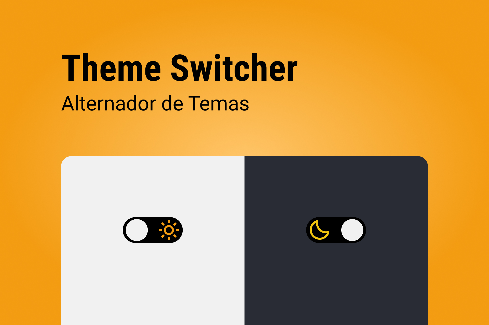

<h1 align="center"> Switcher Theme 👨🏽‍💻 </h1>

Página web com alternador de tema (Light and Dark)

  <a href="#-tecnologias">Tecnologias</a>&nbsp;&nbsp;&nbsp;|&nbsp;&nbsp;&nbsp;
  <a href="#-projeto">Projeto</a>&nbsp;&nbsp;&nbsp;|&nbsp;&nbsp;&nbsp;
  <a href="#-layout">Layout</a>&nbsp;&nbsp;&nbsp;|&nbsp;&nbsp;&nbsp;

 

  

## 🚀 Tecnologias

Esse projeto foi desenvolvido com as seguintes tecnologias:

- HTML e CSS
- JavaScript
- Git e Github
- Figma

## 💻 Projeto

O Switcher Theme é um projecto desenvolvido com fins didáticos, com o intuito de desenvolver um component do tipo Switcher, que é responsável por alterar o tema da página web.

## 🔖 Layout

Você pode visualizar o layout do projeto através [DESSE LINK](<https://www.figma.com/file/wkx6ZDQErMVw5wZAYf5KM6/DD-%2F-Theme-Switcher-(Copy)?node-id=804%3A2&t=DdRerIUvjZrq6A9w-0>). É necessário ter conta no [Figma](https://figma.com) para acessá-lo.

Feito com ♥ by Daniel Koti
